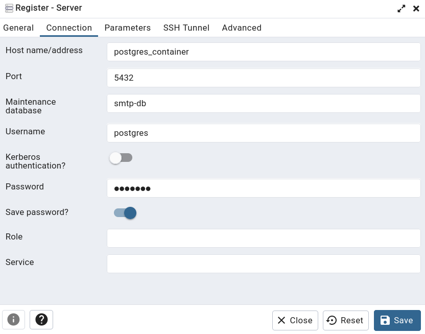
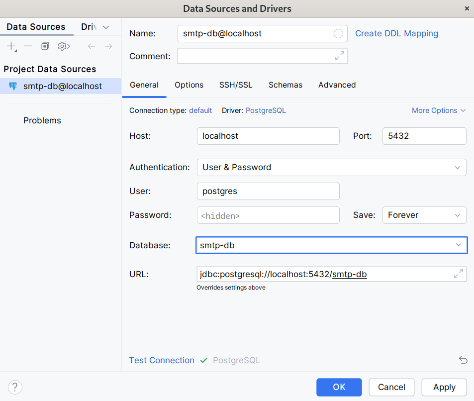

# SMTP project 

## Description
A client-server application where the client and server communicate with each other using the SMTP (Simple Mail Transfer Protocol) to send and receive messages.

## Setup Pre-Commit Hooks

After cloning this repository, you need to set up the pre-commit hooks to ensure the linters are enabled and run before each commit. You can do this by running one of the following setup scripts.

### Option 1: Using Python Script
1. Ensure you have Python 3 installed.
2. Run the following command to set up the pre-commit hooks:
   ```bash
   python3 setup-pre-commit-hook.py
   ```

This will configure the Git hooks and make the pre-commit hook executable.

### Option 2: Using Shell Script
1. If you prefer using a shell script, you can also run:
   ```bash
   ./setup-pre-commit-hook.sh
   ```
   This will perform the same setup as the Python script.

### What the Scripts Do

- Set the `core.hooksPath` Git configuration to point to the `.githooks` directory.
- Make the pre-commit hook executable, ensuring linter and formatter are run before each commit.

Once the setup is complete, the pre-commit hook will automatically trigger the linters (such as `clang-tidy` and `clang-format`) whenever you try to commit changes to the repository.

## Available Build Presets

### Linux Specific Build Presets:
- #### LinuxDebugASan
  - Debug build with address sanitizers (ASan).

- #### LinuxDebugTSan
  - Debug build with thread sanitizers (TSan).

- #### LinuxRelease
  - Release build with no sanitizers enabled. 

### Windows Specific Build Presets:
- #### WindowsDebugASan
   - Debug build with address sanitizers (ASan).

- #### WindowDebugTSan
   - Debug build with thread sanitizers (TSan).

- #### WindowsRelease
   - Release build with no sanitizers enabled.


To build with a specific preset, you can run the following command:
```bash
cmake --preset <PresetName>
cmake --build build/<PresetName>
```

### Info about sanitizers:
-  [Address Sanitizer](https://clang.llvm.org/docs/AddressSanitizer.html)
-  [Thread Sanitizer](https://clang.llvm.org/docs/ThreadSanitizer.html)

## Docker Compose

### Start

```shell
docker-compose --project-name="smtp-project" up -d
```

### Stop

```shell
docker-compose --project-name="smtp-project" down
```

## Access to PgAdmin

Open in browser [http://localhost:5050](http://localhost:5050)

## Add a new server in PgAdmin

* Host name/address `postgres_container` (as Docker-service name)
* Port `5432` (inside Docker)
* Maintenance database `smtp-db` (as `POSTGRES_DB`)
* Username `postgres` (as `POSTGRES_USER`)
* Password `smtp!!!` (as `POSTGRES_PASSWORD`)



## Add a new server in CLion

* Host `localhost`
* Port `5432`
* Maintenance database `smtp-db` (as `POSTGRES_DB`)
* Username `postgres` (as `POSTGRES_USER`)
* Password `smtp!!!` (as `POSTGRES_PASSWORD`)

